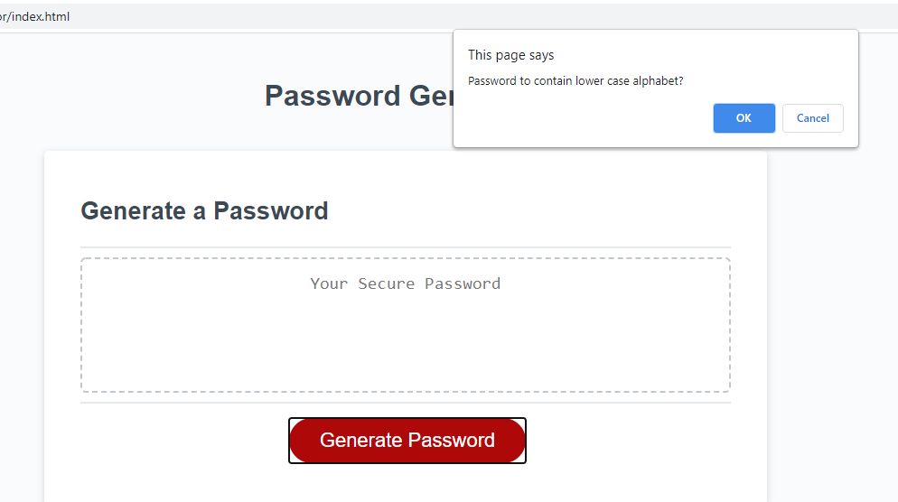

# 3-password_generator
The password Generator which is the 3rd week homework assignment
1.0 
    Title
        3-Password_Generator

2.0
    Introduction:
        The goal for the third homework assignment was to build a password generator. The specifications for completion was that using a series of prompt/confirmation windows, the user can create a random password that is between 8 and 128 characters. It can contain up to, lower case, upper case alphabet, numeric numbers 0-9, or special characters. The user has the choice whether to include 1 to all 4 types of characters in their password generation.

3.0
    Technologies:
        Javascript, the htlm and css were provided by the course

4.0 
    Launch:
        The Website can be located at: https://speakeasyman.github.io/3-password_generator/

        The Repo can be located at: https://github.com/speakeasyman/3-password_generator

5.0
    My goals:
        So, I made four arrays that can be summated to create the character list for the password database. When the user clicks on the button, they will be prompted to dictate the list the length of their generated password. Then be able to select whether to include lowercase, uppercase, numbers, and/or special characters. They can use any combination of the four arrays I created.

6.0
    Examples from the website:
        
        This is where the length between 8 and 128 characters are entered.

        
        Select "OK" for yes, and cancel for no.